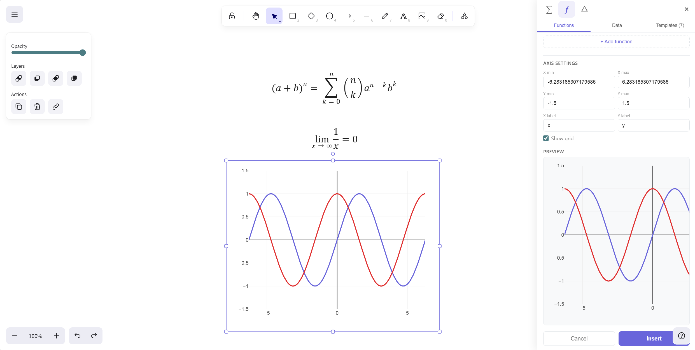

<p align="center">
  <strong>ExcaliMath</strong><br>
  A math-ready whiteboard that feels like Excalidraw — not like a separate tool bolted on.
</p>

<p align="center">
  <a href="https://github.com/tamerUAE/excalimath/blob/main/LICENSE"></a>
  <a href="https://github.com/tamerUAE/excalimath"></a>
  
  
  
</p>

<p align="center">
  
</p>

---

**ExcaliMath** is an open-source companion plugin for [Excalidraw](https://excalidraw.com) that transforms it into a full-featured math whiteboard. It wraps — never forks — the `@excalidraw/excalidraw` React component, injecting three capability layers:

1. **Equation Layer** — LaTeX authoring via KaTeX with live preview and click-to-edit
2. **Graph Layer** — Function plotting via Plotly.js with multi-function support and templates
3. **Shape Libraries** — 80+ curriculum-aligned STEM shapes across 6 subject packs

Built for students, teachers, and content authors. Available as a React component library (`@excalimath/core`) and as a standalone desktop app.

## Features

### Equation Layer
- **Visual toolbar** — click to insert fractions, integrals, Greek letters, matrices, and more. No LaTeX syntax knowledge needed.
- Write LaTeX directly or use the toolbar — live preview as you type
- Click any equation on the canvas to reopen and edit it
- 40+ pre-built expression library across 9 categories
- Graceful error handling with clear parse error messages

### Graph Layer
- Plot functions like `sin(x)`, `x^2 + 2*x` with safe evaluation via mathjs (never uses `eval()`)
- Up to 5 colour-coded functions per graph
- Configurable axes: range, labels, grid, tick intervals
- Transparent or custom background colour
- CSV data import for scatter and line plots
- 7 preset templates: linear, parabola, trig, unit circle, number line, exponential, absolute value
- Click-to-edit restores full graph configuration

### Shape Libraries
- **Geometry** (K-10): Triangles, circles, polygons, coordinate grid, number line, protractor
- **Algebra** (Gr 3-10): Fraction bars, algebra tiles, Venn diagrams, function machine
- **Statistics** (Gr 5-12): Bar chart, pie chart, histogram, scatter plot, box plot
- **Physics / Circuits** (Gr 8-12): 30 components — resistors, capacitors, transistors (NPN/PNP), all 7 logic gates, meters, diodes, and more
- **Biology** (Gr 5-12): Cell diagrams, DNA helix, mitosis stages, food web
- **Chemistry** (Gr 7-12): Bohr atom, periodic table tile, bond types, lab equipment
- Search across all packs, toggle packs on/off, import custom `.excalidrawlib` files

### Desktop App
- Native Windows/macOS/Linux app powered by [Electrobun](https://electrobun.dev)
- All features work fully offline — no browser or internet required
- Portable distribution (unzip and run)

### Additional
- Dark and light theme support (auto-detects from Excalidraw)
- Round-trip fidelity: save and reopen `.excalidraw` files with equations and graphs intact
- `onSave` callback for integration with host applications
- ARIA roles and keyboard accessibility

## Quick Start

### Web (React)

```bash
git clone https://github.com/tamerUAE/excalimath.git
cd excalimath
npm install
npm run dev
```

Open [http://localhost:5173](http://localhost:5173) to see the demo.

### Desktop

```bash
cd apps/desktop
npx electrobun dev
```

## Usage

```tsx
import { Excalidraw } from "@excalidraw/excalidraw";
import { ExcaliMath } from "@excalimath/core";

function App() {
  const [api, setApi] = useState(null);

  return (
    <Excalidraw
      excalidrawAPI={setApi}
      renderTopRightUI={() =>
        api ? (
          <ExcaliMath
            excalidrawAPI={api}
            enabledPlugins={["equation", "graph", "library"]}
            theme="auto"
            onSave={(data) => console.log("Saved:", data)}
          />
        ) : null
      }
    />
  );
}
```

### Component API

| Prop | Type | Default | Description |
|------|------|---------|-------------|
| `excalidrawAPI` | `ExcalidrawImperativeAPI` | required | The Excalidraw API ref |
| `enabledPlugins` | `Array<"equation" \| "graph" \| "library">` | all enabled | Which plugins to show |
| `theme` | `"light" \| "dark" \| "auto"` | `"auto"` | Theme override (auto reads from Excalidraw) |
| `initialData` | `ExcalimathSceneData` | — | Load a saved scene with auto-restore |
| `onSave` | `(data: ExcalimathSceneData) => void` | — | Called on every insert/update for persistence |

## Architecture

ExcaliMath is a **non-destructive companion wrapper** — it composes with Excalidraw, never forks it.

```
excalimath/
├── packages/
│   └── core/                    @excalimath/core — the plugin library
│       └── src/
│           ├── core/
│           │   ├── elementFactory.ts   SVG → Excalidraw imageElement conversion
│           │   ├── stateBridge.ts      Click-to-edit metadata detection
│           │   ├── roundTrip.ts        Save/load restoration of equations + graphs
│           │   └── types.ts            Shared type definitions
│           ├── plugins/
│           │   ├── equation/           KaTeX renderer + expression library
│           │   ├── graph/              Plotly renderer + mathjs evaluator + templates
│           │   └── geometry/           Shape library packs + registry
│           └── ui/
│               ├── ExcaliMath.tsx       Main wrapper (toolbar + sidebar + tab navigation)
│               ├── EquationPanel.tsx    LaTeX editor with live preview
│               ├── GraphPanel.tsx       Function plotter with axis config
│               ├── LibraryPanel.tsx     Shape browser with search + filtering
│               └── theme.ts            Light/dark theme tokens
└── apps/
    ├── demo/                    Web demo app
    └── desktop/                 Electrobun desktop app (isolated from npm workspaces)
```

### How it works

1. **Wrapper Shell** — `ExcaliMath` component injects a sidebar via Excalidraw's `renderTopRightUI` hook. A single toggle button opens a panel with tabbed navigation.
2. **Plugin Modules** — Three independent modules (equation, graph, geometry), each independently loadable via the `enabledPlugins` prop.
3. **Element Factory** — Converts rendered SVG (KaTeX MathML / Plotly charts / SVG gate symbols) into Excalidraw `imageElement` objects with embedded data URLs.
4. **State Bridge** — Tags inserted elements with `customData` metadata to enable click-to-edit. When a user clicks an equation or graph, the metadata is read to restore the editor with the original settings.
5. **Round-Trip** — Monitors the scene for ExcaliMath elements missing their SVG file data (e.g. after opening a saved file) and regenerates them from stored metadata.

## Tech Stack

| Concern | Library | Why |
|---------|---------|-----|
| Equation rendering | KaTeX 0.16+ | Fastest LaTeX renderer; MathML output works in data URLs |
| Graph plotting | Plotly.js (SVG mode) | Declarative, high-quality SVG; no canvas/WebGL dependency |
| Function evaluation | mathjs | Safe expression parsing — never uses `eval()` |
| Component framework | React 18 | Matches Excalidraw's own stack |
| Build tooling | Vite + TypeScript (strict) | Fast HMR, clean ESM output for npm |
| Desktop shell | Electrobun | Native window with WebView2; sub-50MB bundle |

## Scripts

| Command | Description |
|---------|-------------|
| `npm run dev` | Start the web demo in dev mode |
| `npm run build` | Build core library + demo app |
| `npm run build:core` | Build `@excalimath/core` only |
| `npm run typecheck` | TypeScript type checking |

For desktop app scripts, see [apps/desktop/README.md](apps/desktop/README.md).

## Roadmap

- [x] **v0.1** — Equation Layer (KaTeX + live preview + expression library)
- [x] **v0.2** — Graph Layer (Plotly + mathjs + templates + CSV data)
- [x] **v0.3** — Shape Libraries (6 STEM packs, 80+ shapes, SVG logic gates)
- [x] **v1.0** — Integration-Ready Release (component API, round-trip fidelity, AuthorKit spec)
- [x] **vDesktop** — Electrobun Desktop App (Windows, macOS, Linux)

## Contributing

We welcome contributions! See [CONTRIBUTING.md](CONTRIBUTING.md) for guidelines.

Please read our [Code of Conduct](CODE_OF_CONDUCT.md) before participating.

## License

[MIT](LICENSE) — built by [Tamer](https://github.com/tamerUAE) at ITWorx EdTech.
